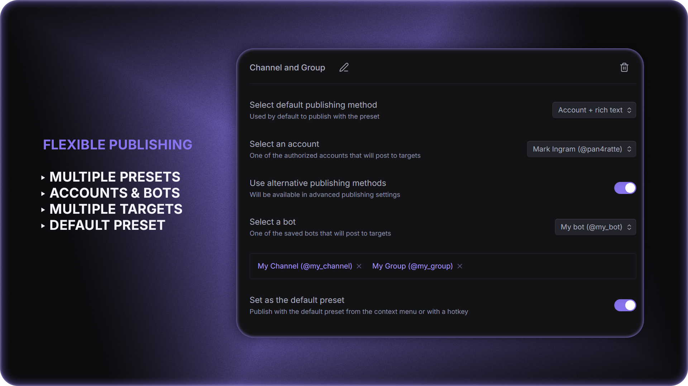
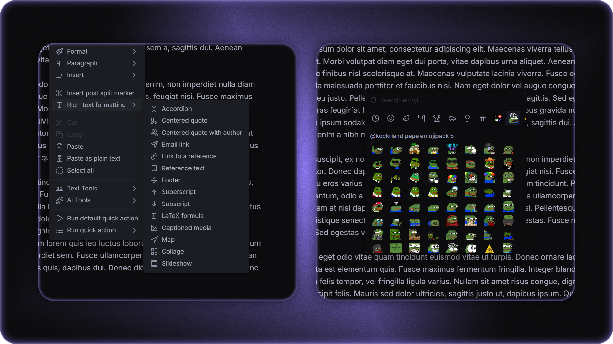

# Publish to Telegram plugin

English | [Русский](https://github.com/pan4ratte/obsidian-publish-to-telegram/blob/main/README_RU.md)

Post notes directly to Telegram channels, groups, forum topics and personal messages, as your own account or as a bot. Standard and rich-text Telegram formatting, media and document attachments, and custom emoji are supported. Advanced publishing settings let you preview every message, schedule it, split a note into several posts, and edit what you already published.

<div align="center">
  
</div>

<div align="center">
<br>
<a href="https://github.com/pan4ratte/obsidian-publish-to-telegram/releases"></a>
<a href="https://github.com/pan4ratte/obsidian-publish-to-telegram/releases"></a>
<a href="https://github.com/mtcute/mtcute"><picture><source media="(prefers-color-scheme: dark)" srcset="https://shieldcn.dev/badge/built%20with-mtcute-8a75f0.svg?logo=data%3Aimage%2Fsvg%2Bxml%2C%3Csvg+xmlns%3D%27http%3A%2F%2Fwww.w3.org%2F2000%2Fsvg%27+viewBox%3D%270+0+24+24%27%3E%3Cpath+fill%3D%27%2523de6fbe%27+d%3D%27M18+1.6a3.6+3.6+0+0+1+1.3+5l-1+1.8h2.1a3.6+3.6+0+0+1+0+7.2h-2.2l1.1+1.9a3.6+3.6+0+1+1-6.2+3.6L4.7+6.5A3.6+3.6+0+0+1+10.9+3L12+4.8l1-1.9a3.6+3.6+0+0+1+5-1.3%27%2F%3E%3Cpath+fill%3D%27%2523f69ddc%27+d%3D%27M15.1+13.8a3.6+3.6+0+0+0-3.3-5.4H3.6a3.6+3.6+0+0+0+0+7.2h2.2l-1.1+1.9a3.6+3.6+0+0+0+6.2+3.6z%27%2F%3E%3C%2Fsvg%3E&amp;mode=dark"></picture></a>
</div>


## Features

### 1. Publishing notes to any chat

Create presets for channels, groups, forum topics and personal messages. A single preset can hold several target chats, and you can search through your chat list after authorization or enter a `@username` or `ID` manually. A default preset lets you publish instantly with a single hotkey.

<div align="center">
  
</div>

### 2. Four publishing methods

As your account, as a bot, or either of them with rich-text formatting. The method can be saved in a preset or an alternative one picked in the advanced publishing settings. You can also make a one-time post without a preset at all. Publishing is available with a hotkey, the command palette, the file context menu or the advanced publishing settings.

### 3. Full support for Telegram formatting

Not only standard formatting is supported, but rich-text elements as well: accordions, centered quotes, references, LaTeX formulas, maps, collages and slideshows. Attachments are available too — photo, video, audio, albums and documents. An emoji bar with search mirrors Telegram's categories and loads the custom packs added to your account. `\split` markers and rich-text formatting elements are inserted straight from the note editor's context menu.

<div align="center">
  
</div>

### 4. Splitting notes into several posts

Publish several posts in a row from a single note and attach pre-written comments to them, which land in the post's discussion — or become replies to the message, if it is published in a group or in personal messages.

### 5. Preview and settings for every post

The advanced publishing settings show every message the way Telegram will render it, attachment placement and link preview included. For every post you can set: silent publishing, attachments below the text, the link preview's source and placement, scheduled publishing, sending when the recipient comes online, as well as specify whether it is published, edited or skipped.

<div align="center">
  
</div>

### 6. Editing posts and comments

Edit posts and comments right from the note they were published from. To do that, enable automatic saving of post links to the note's properties.

---

**A detailed user guide with setup walkthroughs and a description of every feature and every supported formatting option is available right in the plugin settings and can be opened from the command palette.**


## Installation

### Option 1: Obsidian plugin store

1. In Obsidian settings open the tab "Community plugins" and click "Browse" button.

2. In the search bar type `Publish to Telegram`, click on the result, then "Install" and "Enable" buttons.

Alternatively, you can install the plugin by following the link to the community website: [https://community.obsidian.md/plugins/publish-to-telegram](https://community.obsidian.md/plugins/publish-to-telegram)

### Option 2: BRAT plugin

If you want to test beta-versions of the plugin or use previous versions, you can do that with `BRAT` plugin:

1. Install `BRAT` plugin from the official Obsidian plugin store.

2. In the `BRAT` settings, find the “Beta plugin list” section and click on the “Add beta plugin” button.

3. In the window that appears, paste the link to the `Publish to Telegram` plugin repository: [https://github.com/pan4ratte/obsidian-publish-to-telegram](https://github.com/pan4ratte/obsidian-publish-to-telegram)

4. Under “Select a version” choose the desired version and click the “Add plugin” button. The plugin will be automatically installed and will be ready to use.


# User guide

To post notes to Telegram, you need to set up a preset. When creating a preset, you can choose any posting method as the primary one and use the others optionally, when necessary.

## 1. Publishing as an account

**Important aspects of this publishing method:**

* Posting as an account lets you use Telegram Premium features. Since July 2026 it can also post rich-text messages — choose the “Account + rich text” method — but that specifically *requires Telegram Premium* on the account (Telegram’s restriction). The plain “Account” method needs no Premium.

* The plugin supports logging into multiple accounts.

* Accounts can post not only to channels but also to groups, private chats, and bots without additional settings (provided you have permission to send messages).

**Setup:**

1. In the plugin settings, click the “Log In” button and sign in to your account. You can authorize using a phone number or a QR code. Your sessions are stored locally in encrypted form in your Obsidian Keychain.

2. Create a new preset, and under “Select primary publishing method,” choose “Account” or “Account + rich text.”

3. In the option that appears, select one of your authorized accounts.

4. Under “Use secondary publishing methods,” check the box if you want to post as a bot when necessary. You can change this setting at any time.

5. If the “Use secondary publishing methods” option is selected, choose previously added bot from the list that appears (see below for instructions on how to add a bot)

6. Click on the search field to load the list of chats for the selected account, and choose one or more target chats. Alternatively, enter `@username` or `ID` manually. You can get the `@username` or `ID` of any chat from [@userinfobot](https://t.me/userinfobot).

Now you can post notes to Telegram using your preset’s name via the command palette, the note’s context menu, or keyboard shortcuts.

## 2. Publishing as a bot

**Important aspects of this publishing method:**

* Posting as a bot allows you to use rich-text formatting, but does not allow you to use Telegram Premium features due to Telegram's restrictions.

* You can add multiple bots to the plugin.

* Without additional configuration, bots can only post messages to channels (provided the bot is added to the channel, has admin rights, and is allowed to send messages).

  * To send messages to groups, you must disable the “Group Privacy” option in the [@BotFather](https://t.me/BotFather) mini-app in the bot’s settings.
  * To send messages to other bots, you must enable the “Bot to Bot Communication Mode” option in the [@BotFather](https://t.me/BotFather) mini-app in the bot's settings.
  * Bots cannot send messages to users unless the user has initiated a chat with that bot.

* The bot can optionally post text with standard formatting, without rich-text formatting.

**Setup:**

1. In the plugin settings, click the “Add bot” button, and in the window that appears, click “[Open @BotFather](https://t.me/BotFather)”.

2. In the chat that opens, follow the instructions to create your own bot and copy its token.

4. Paste your bot’s token into the corresponding field in the plugin and click “Save.” Your bot tokens are stored locally in encrypted form in your Obsidian Keychain.

5. Create a new preset, and under “Select primary publishing method,” choose either “Bot” or “Bot + rich text.”

6. In the menu that appears, select one of your saved bots.

7. Under “Use secondary publishing methods,” check the box if you want to post as an account when necessary. You can change this setting at any time.

8. If the “Use secondary publishing methods” option is selected, choose a previously authorized account from the menu that appears (see above for instructions on how to authorize).

9. Click on the search field to load the list of chats for the selected account and choose one or more target chats. Alternatively, enter `@username` or `ID` manually. You can find the `@username` or `ID` of any chat using [@userinfobot](https://t.me/userinfobot).

Now you can post notes to Telegram using your preset’s name via the command palette, the note’s context menu, or keyboard shortcuts.

## 3. Standard formatting

Standard formatting is available for posts made via the “Account” and “Bot” methods. All standard Telegram formatting elements are supported, as well as some additional ones:

<table>
  <thead>
    <tr>
      <th>Obsidian Input</th>
      <th>Telegram Result</th>
    </tr>
  </thead>
  <tbody>
    <tr>
      <td><code>**Bold**</code></td>
      <td><strong>Bold</strong></td>
    </tr>
    <tr>
      <td><code>*Italic*</code></td>
      <td><em>Italic</em></td>
    </tr>
    <tr>
      <td><code>&lt;u&gt;Underline&lt;/u&gt;</code></td>
      <td><u>Underline</u></td>
    </tr>
    <tr>
      <td><code>~~Strikethrough~~</code></td>
      <td><s>Strikethrough</s></td>
    </tr>
    <tr>
      <td><code>&lt;tg-spoiler&gt;Spoiler&lt;/tg-spoiler&gt;</code></td>
      <td>Spoiler</td>
    </tr>
    <tr>
      <td><code>`Inline code`</code></td>
      <td><code>Inline code</code></td>
    </tr>
    <tr>
      <td><code>[Link](url)</code></td>
      <td><a href="https://obsidian.md">Link</a></td>
    </tr>
    <tr>
      <td><code>&gt; Quote</code></td>
      <td><blockquote>Quote</blockquote></td>
    </tr>
    <tr>
      <td><codeblock>```<br>Code block<br>```</codeblock></td>
      <td><pre><code>Code block</code></pre></td>
    </tr>
    <tr>
      <td><code>- List</code> or <code>* List</code> or <code>+ List</code></td>
      <td><ul><li>List</li></ul></td>
    </tr>
    <tr>
      <td><code>1. List</code> or <code>1) List</code></td>
      <td>1. List or 1) List</td>
    </tr>
    <tr>
      <td><code># Heading</code></td>
      <td><h5>Heading</h5></td>
    </tr>
    <tr>
      <td><code>---</code> or <code>***</code> or <code>___</code></td>
      <td>───</td>
    </tr>
  </tbody>
</table>

### 3.1 Omitting text from a post

In addition to the formatting that will be reflected in the Telegram post, you can use the comment syntax `<!-- hidden text -->` or `%% hidden text %%` to add information to your notes that will not be included in the post content when it is published.

### 3.2 Splitting the note into multiple posts

You can also use the special command `<!-- \split -->` or `%% \split %%` to split the text of your note into separate posts. How the feature works:

* When you use the command, the plugin publishes all posts at the same time.

* Attachments (see below), including pre-written comments, must be placed *before the split command*, which marks the *end* of the post.

* After a split note is published, if link saving to the note's properties is enabled in the settings, the link to each post is written inside its `\split` command — for example `%% \split t.me/channel/123 %%`. If the last post has no command, one is added automatically.

* When you republish the same note, the new links are written too — for example `%% \split t.me/channel/1 | t.me/channel/2 %%`. When editing posts, the plugin relies on these links.

* You can insert the `%% \split %%` command into the text with the **Insert post split marker** command in the note's editor context menu.

* In the advanced publishing settings, a split note shows a preview of every post with its own row of publishing settings and lets you choose which posts to publish.

### 3.3 Attachments

Media, album (groups of media) and document attachments are supported. To attach a file to your post, use any of the standard Obsidian embed syntax options:

`![[some-book-file.pdf]]`

``

`!(some-video-file.mp4)[]`

You can also embed files with external web-link embeds:

``

Currently supported formats:

| Extension                                          | Attachment type |
| -------------------------------------------------- | --------------- |
| `.jpg`, `.jpeg`, `.png`, `.webp` 		             	 | Photo / Album   |
| `.gif`                                             | Animation       |
| `.mp4`, `.mov`, `.avi`, `.mkv`, `.webm`            | Video / Album   |
| `.pdf`, `.md`                                      | Document        |

Audio files (`.mp3`, `.ogg`, `.m4a`, `.wav`, `.flac`) are supported only inside a rich-text message — see [Rich-text formatting](#4-rich-text-formatting) below.

**One post per publish (classic methods).** The “Account” and “Bot” methods send your attachments as a single Telegram message — a photo/video album, or a document album. If your attachments can't fit in one message, the whole post is refused with an error (nothing is sent in fragments). This happens when you combine things Telegram can't group in one album (an album together with an animation/GIF or a document, or several GIFs), when an album would exceed 10 items, and — on the “Account” method only — when you mix photos and videos in the same album (the “Bot” method handles that combination). To publish such a set, use a rich-text method (which places everything in one rich message) or split the attachments across separate posts.

## 4. Rich-text formatting

Rich-text formatting is available for posts made via the “Bot + rich text” and “Account + rich text” methods (the account method requires Telegram Premium). Telegram’s Rich Markdown is compatible with GitHub-Flavored Markdown, so the plugin passes your note’s Markdown through almost verbatim: everything listed under [Standard formatting](#3-standard-formatting) is supported, and the elements below render natively instead of being simplified (for example, headings keep all six levels instead of collapsing to a single bold style).

<table>
  <thead>
    <tr>
      <th>Obsidian Input</th>
      <th>Telegram Result</th>
    </tr>
  </thead>
  <tbody>
    <tr>
      <td><code># Heading 1</code> … <code>###### Heading 6</code></td>
      <td>Six heading levels (H1–H6), each at its own size</td>
    </tr>
    <tr>
      <td><code>==Highlight==</code></td>
      <td><mark>Highlight</mark></td>
    </tr>
    <tr>
      <td><code>||Spoiler||</code></td>
      <td>Spoiler (hidden until tapped)</td>
    </tr>
    <tr>
      <td><code>H&lt;sub&gt;2&lt;/sub&gt;O</code></td>
      <td>H<sub>2</sub>O</td>
    </tr>
    <tr>
      <td><code>x&lt;sup&gt;2&lt;/sup&gt;</code></td>
      <td>x<sup>2</sup></td>
    </tr>
    <tr>
      <td><code>$x^2 + y^2$</code></td>
      <td>Inline LaTeX formula</td>
    </tr>
    <tr>
      <td><code>$$E = mc^2$$</code> or <codeblock>```math<br>E = mc^2<br>```</codeblock></td>
      <td>Centered LaTeX formula block</td>
    </tr>
    <tr>
      <td><code>1. First</code><br><code>2. Second</code></td>
      <td><ol><li>First</li><li>Second</li></ol></td>
    </tr>
    <tr>
      <td><code>- [ ] To do</code><br><code>- [x] Done</code></td>
      <td>☐ To do<br>☑ Done</td>
    </tr>
    <tr>
      <td><codeblock>| A | B |<br>|---|---|<br>| 1 | 2 |</codeblock></td>
      <td><table><tr><th>A</th><th>B</th></tr><tr><td>1</td><td>2</td></tr></table></td>
    </tr>
    <tr>
      <td><code>Text[^1]</code><br><code>[^1]: Footnote</code></td>
      <td>Text<sup>1</sup>, with the footnote shown at the bottom</td>
    </tr>
    <tr>
      <td><codeblock>```python<br>print("hi")<br>```</codeblock></td>
      <td><pre><code>print("hi")</code></pre>code block with syntax highlighting for the named language</td>
    </tr>
    <tr>
      <td><code>&lt;details&gt;&lt;summary&gt;Title&lt;/summary&gt;Content&lt;/details&gt;</code></td>
      <td><details><summary>Title</summary>Content</details></td>
    </tr>
    <tr>
      <td><code>&lt;aside&gt;Pull quote&lt;/aside&gt;</code></td>
      <td>Centered pull quote</td>
    </tr>
    <tr>
      <td><code></code><br><code></code></td>
      <td>Photo, video, or audio rendered inline in the message, with an optional caption</td>
    </tr>
  </tbody>
</table>

### 4.1 Auto-detected entities

Telegram automatically detects and links several kinds of inline text — you don’t need any special syntax, just type them:

`#hashtag`, `$USD` (cashtag), `@username`, `/command`, phone numbers, and bank-card numbers.

A `#hashtag` is written exactly as in Obsidian; the plugin escapes it automatically so Telegram renders it as a clickable hashtag rather than a heading.

### 4.2 Advanced elements

Because Rich Markdown may contain arbitrary HTML, you can also write Telegram’s rich-message tags directly in your note for elements that have no Markdown shorthand. The full set of supported tags and attributes:

**Inline formatting**

| Tag(s) | Meaning |
| --- | --- |
| `<b></b>`, `<strong></strong>` | Bold |
| `<i></i>`, `<em></em>` | Italic |
| `<u></u>`, `<ins></ins>` | Underline |
| `<s></s>`, `<strike></strike>`, `<del></del>` | Strikethrough |
| `<code></code>` | Inline fixed-width code |
| `<mark></mark>` | Highlight (marked text) |
| `<sub></sub>` | Subscript |
| `<sup></sup>` | Superscript |
| `<tg-spoiler></tg-spoiler>` | Spoiler |
| `<tg-emoji emoji-id="…"></tg-emoji>` | Custom emoji |
| `<tg-time unix="…" format="…"></tg-time>` | Formatted date-time entity |
| `<tg-math></tg-math>` | Inline LaTeX formula |

**Links, anchors & references**

| Tag | Meaning |
| --- | --- |
| `<a href="https://…"></a>` | Inline URL |
| `<a href="mailto:…"></a>` | E-mail link |
| `<a href="tel:…"></a>` | Phone-number link |
| `<a href="tg://user?id=…"></a>` | Inline user mention |
| `<a name="…"></a>` | Anchor target |
| `<a href="#…"></a>` | In-document link to an anchor or reference |
| `<tg-reference name="…"></tg-reference>` | Referenced text, linked to with `<a href="#…"></a>` |

**Block elements**

| Tag | Meaning |
| --- | --- |
| `<h1></h1>` … `<h6></h6>` | Headings (six sizes) |
| `<p></p>` | Paragraph |
| `<pre></pre>` | Preformatted code block |
| `<pre><code class="language-…"></code></pre>` | Code block with syntax highlighting for the named language |
| `<blockquote></blockquote>` (with `<cite></cite>`) | Block quotation, optional credit |
| `<aside></aside>` (with `<cite></cite>`) | Pull quote (centered), optional credit |
| `<footer></footer>` | Footer text |
| `<hr/>` | Divider |
| `<ul><li></li></ul>` | Unordered list |
| `<ol><li></li></ol>` | Ordered list — `<ol>` accepts `start`, `type` (`a`/`A`/`i`/`I`/`1`) and `reversed`; `<li>` accepts `value` and `type` |
| `<details></details>` (with `<summary></summary>`) | Collapsible block — add `open` to expand it by default |
| `<tg-math-block></tg-math-block>` | LaTeX formula block |

**Media** (HTTP(S) URLs only)

| Tag | Meaning |
| --- | --- |
| `` | Photo |
| `<video src="…">` | Video, or animation for a `.gif` source |
| `<audio src="…">` | Audio file or voice note |
| `<figure></figure>` + `<figcaption></figcaption>` (with `<cite></cite>`) | Captioned media; add the `tg-spoiler` attribute on the media element to cover it with a spoiler |
| `<tg-map lat="…" long="…" zoom="…"/>` | Map block |
| `<tg-collage></tg-collage>` | Media collage |
| `<tg-slideshow></tg-slideshow>` | Media slideshow |

**Tables**

| Tag | Meaning |
| --- | --- |
| `<table></table>` | Table — accepts `bordered` and `striped` |
| `<caption></caption>` | Table caption |
| `<tr></tr>`, `<th></th>`, `<td></td>` | Rows, header cells and data cells |
| Cell attributes | `colspan`, `rowspan`, `align` (`left`/`center`/`right`), `valign` (`top`/`middle`/`bottom`) |

**HTML entities**

* All numerical HTML entities (e.g. `&#39;`).
* Named entities: `&lt;`, `&gt;`, `&amp;`, `&quot;`, `&apos;`, `&nbsp;`, `&hellip;`, `&mdash;`, `&ndash;`, `&lsquo;`, `&rsquo;`, `&ldquo;`, `&rdquo;`.

**Note:**

* In a **”Bot + rich text”** post, inline media must be an *HTTP(S) web link* — the Bot API can’t upload a local file into a rich message, so a local attachment is rejected with an error (attach it with the classic “Bot” method, or use a web URL).
* An **”Account + rich text”** post can embed *local* media too: photos, videos, GIFs and audio (`.mp3`, `.ogg`, `.m4a`, `.wav`, `.flac`) are uploaded and shown inline, right where you embed them, alongside any web-link media. Only local *documents* (e.g. `.pdf`, or `.md` embeds attached as files) can’t be embedded in a rich message.

### 4.3 Inserting elements from the context menu

You don't have to add this formatting by hand. Right-click in the note editor to open the "Rich-text formatting" submenu and choose an element to insert it into the text or to wrap the selected text.

## 5. The emoji bar

You can insert emoji, including emoji from custom Telegram packs using the emoji bar: 

* To call the bar, run the "Publish to Telegram: Insert emoji" command from the command palette, or bind it to a hotkey such as `Ctrl/Cmd + Shift + E`.
* The search field at the top allows you to filter emoji by keywords in English and Russian.
* Category tabs — Recent, Smileys & people, Animals & nature, etc. — fully repeats native Telegram emoji bar.
* If your account has custom emoji packs saved, they will also load and you can insert them too. Animated emoji will be displayed as static, but will be sent correctly. To publish custom emoji you must have Telegram Premium.

## 6. Pre-written comments

You can pre-write one or more comments for your post that will appear in its discussion right after the publication. To use that feature:

1. In the plugin settings turn on the option "Treat .md embeds as post comments".

2. To prepare a comment for a post, use the `![[comment-file]]` embed syntax. Only files with the .md extension are treated comments.

A couple of notes:

* If a comment on a post is published in a group or in personal messages, it will appear as a regular reply to a message.

* If you split the note into multiple posts (see above), you can attach the comments to each of the posts. To do that, place .md-embeds before the corresponding marker.

* A comment can carry attachments of its own: media and documents from the comment note are sent together with its text.

* Comments can be scheduled together with the post when publishing to a personal chat or a group. That is not possible in a channel with a discussion group: until the post is actually published there is nothing to reply to in the discussion, and the plugin will tell you so without sending anything.

* All comments are published with a slight delay.

## 7. Advanced publishing settings

You can open an advanced publishing settings window with command palette (`Ctrl + P`) by typing "Publish to Telegram: Publish with advanced settings". The advanced settings let you choose presets, configure the posts and see their preview.

### 7.1 Choosing a preset and a method

* The "Post without a preset" section lets you make a one-time post by picking the target chats, the author and the publishing method by hand, without saving a preset.

* Below it is the list of saved presets, and for each of them you can choose the default publishing method or an alternative one.

### 7.2 Post previews

A preview is shown for the post and for the pre-written comments. If the note is split into several posts, each of them is shown. The preview also lets you fine-tune every publication:

* Publish with a soundless notification.

* Move the attachments below the text.

* Set the link preview placement: below the text, above the text, or disabled.

* Send the message when the recipient comes online (only for the "Account" publishing methods).

* Schedule the publication (only for the "Account" publishing methods). Only comments have no date, they are published together with their post.

The "Comments follow post settings" option in the plugin settings repeats the changes of the post settings on its comments. A setting you change on the comment itself stays individual.

**The preview** shows the message the way Telegram will render it:

* When one of the classic publishing methods is selected, attachments are lifted out of the text and shown as an album above or below it — depending on the "Attachments below the text" setting.

* Click a link in the preview window to make it the source of Telegram's link preview (while Ctrl+Click opens the link). The resulting link preview is loaded right in the window.

Also, the publishing settings let you specify whether a post will be published, edited or ignored on publication (the last one is only available when there are several posts in one note).

### 7.3 Editing

Links to published messages are stored in the note's `tg_posts` and `tg_comments` properties, that are filled automatically if the corresponding option is enabled in the settings. You can also create them and fill manually.

An important note: a post is always edited *in its original style* — a rich-text post stays rich-text and a classic post stays classic, regardless of which preset you edit it with.

## 8. Limits

Standard Telegram posting limits apply to posts, sent via "Account" and "Bot" methods. A rich-text message may contain up to 32768 characters, 500 blocks, 16 levels of nesting, 50 media attachments, and 20 table columns. More about limits: [https://limits.tginfo.me/](https://limits.tginfo.me/)

I also highly recommend my other plugin, [Advanced Word Count](https://community.obsidian.md/plugins/advanced-word-count), that allows you to create detailed presets for word counting in notes and offers significantly greater functionality, compared to the standard Obsidian word counter. This plugin can be easily configured to count characters exactly the same way Telegram does: its plugin extension store includes ready-made presets for Telegram.

# About the Author

My name is Mark Ingrem and I am a Religious Studies scholar. Apart from my main area of study (Protestant Political Theology in Russia), I teach a university course called "Information Technologies in Scientific Research", which is based on my own unique program. This plugin helps me in my research and I use it in my teaching, along with the other plugins I develop, which you can find on [my GitHub profile](https://github.com/pan4ratte/).

Hello to every student who came across this page!

Huge thanks to [Egor Gvozdikov](https://github.com/egorgvo), who wrote the first lines of code for this project and made numerous valuable commits.

---

In compliance with the Obsidian community guidelines, all external network calls should be disclosed in the plugin README and only made with user knowledge. This plugin makes network calls only to [t.me](https://t.me)
