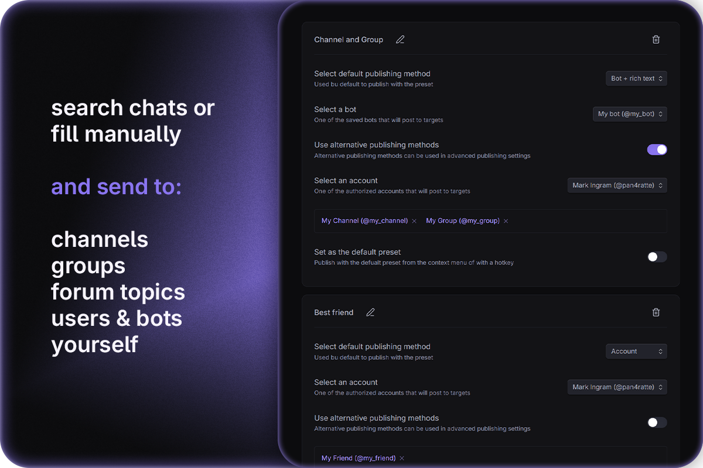
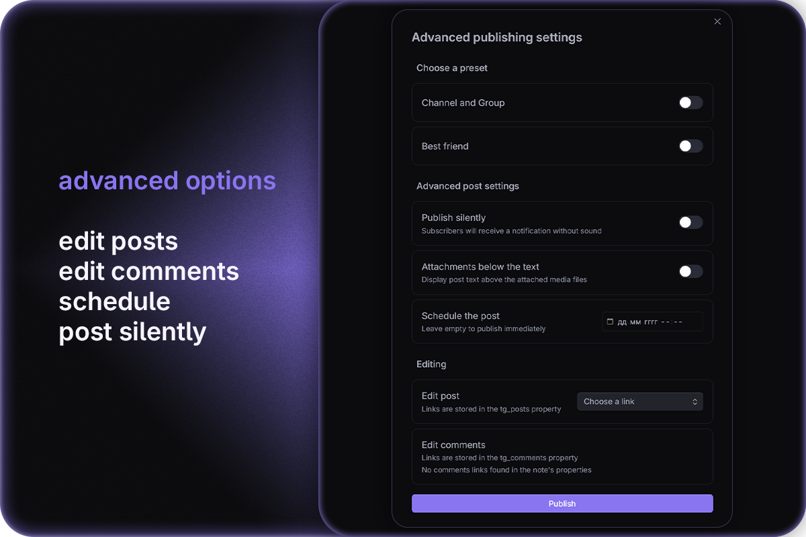

# Publish to Telegram plugin

English | [Русский](https://github.com/pan4ratte/obsidian-publish-to-telegram/blob/main/README_RU.md)

This plugin allows you to post notes directly to Telegram channels, groups and personal messages with different presets. Standard Telegram formatting, rich-text formatting for bots, as well as media and document attachments are supported. Advanced publishing settings allow you to schedule posts, edit posts and comments and more.

<div align="center">
  
  
  
  
</div>


## Features

1. Create presets to post to different channels, groups, forum topics and personal messages:

    * A preset can hold multiple target chats at once.
    * Four optional publication methods: by account, by account with rich-text formatting, by bot, or by bot with rich-text formatting.
    * Search field, that loads chat list if authorization is complete and account is picked.
    * Option to enter target chat `@username` or `ID` manually.

2. Post in different ways: with hotkeys, command palette and context menus, as well as through advanced publishing settings menu.

3. Advanced publishing settings:

    * Post with preset, using alternative publication method.
  	* Post without sound.
  	* Post with attached media under the text.
    * Schedule the publication.
    * Edit already existing posts or pre-written comments.

4. Photo, video, album and document attachments.

5. Publish pre-written commentaries to the post discussion (or as replies to the message if it was posted in a group or sent to a user).

6. Set up a default preset to post quickly with it or use command palette or hotkeys.

7. Option to enable automatic posts and comments links saving to the note's properties.   

8. Publish multiple posts in a row from a single note using a special command that splits the note's text into separate posts.

9. Detailed user guide in the plugin settings with detailed description of all features and supported formatting options.


## Installation

### Option 1: Obsidian plugin store

1. In Obsidian settings open the tab "Community plugins" and click "Browse" button.

2. In the search bar type `Publish to Telegram`, click on the result, then "Install" and "Enable" buttons.

Alternatively, you can install the plugin by following the link to the community website: [https://community.obsidian.md/plugins/publish-to-telegram](https://community.obsidian.md/plugins/publish-to-telegram)

### Option 2: BRAT plugin

If you want to test beta-versions of the plugin or use previous versions, you can do that with `BRAT` plugin:

1. Install `BRAT` plugin from the official Obsidian plugin store.

2. In the `BRAT` settings, find the “Beta plugin list” section and click on the “Add beta plugin” button.

3. In the window that appears, paste the link to the `Publish to Telegram` plugin repository: [https://github.com/pan4ratte/obsidian-publish-to-telegram](https://github.com/pan4ratte/obsidian-publish-to-telegram)

4. Under “Select a version” choose the desired version and click the “Add plugin” button. The plugin will be automatically installed and will be ready to use.


# User guide

To post notes to Telegram, you need to set up a preset. When creating a preset, you can choose any posting method as the primary one and use the others optionally, when necessary.

## 1. Publishing as an account

**Important aspects of this publishing method:**

* Posting as an account lets you use Telegram Premium features. Since July 2026 it can also post rich-text messages — choose the “Account + rich text” method — but that specifically **requires Telegram Premium** on the account (Telegram’s restriction). The plain “Account” method needs no Premium.

* The plugin supports logging into multiple accounts.

* Accounts can post not only to channels but also to groups, private chats, and bots without additional settings (provided you have permission to send messages).

**Setup:**

1. In the plugin settings, click the “Log In” button and sign in to your account. You can authorize using a phone number or a QR code. Your sessions are stored locally in encrypted form in your Obsidian Keychain.

2. Create a new preset, and under “Select primary publishing method,” choose “Account” (standard formatting) or “Account + rich text” (rich-text formatting; requires Telegram Premium on the account).

3. In the option that appears, select one of your authorized accounts.

4. Under “Use secondary publishing methods,” check the box if you want to post as a bot when necessary. You can change this setting at any time.

5. If the “Use secondary publishing methods” option is selected, choose previously added bot from the list that appears (see below for instructions on how to add a bot)

6. Click on the search field to load the list of chats for the selected account, and choose one or more target chats. Alternatively, enter `@username` or `ID` manually. You can get the `@username` or `ID` of any chat from [@userinfobot](https://t.me/userinfobot).

Now you can post notes to Telegram using your preset’s name via the command palette, the note’s context menu, or keyboard shortcuts.

## 2. Publishing as a bot

**Important aspects of this publishing method:**

* Posting as a bot allows you to use rich-text formatting, but does not allow you to use Telegram Premium features due to Telegram's restrictions.

* You can add multiple bots to the plugin.

* Without additional configuration, bots can only post messages to channels (provided the bot is added to the channel, has admin rights, and is allowed to send messages).

  * To send messages to groups, you must disable the “Group Privacy” option in the [@BotFather](https://t.me/BotFather) mini-app in the bot’s settings.
  * To send messages to other bots, you must enable the “Bot to Bot Communication Mode” option in the [@BotFather](https://t.me/BotFather) mini-app in the bot's settings.
  * Bots cannot send messages to users unless the user has initiated a chat with that bot.

* The bot can optionally post text with standard formatting, without rich-text formatting.

**Setup:**

1. In the plugin settings, click the “Add bot” button, and in the window that appears, click “[Open @BotFather](https://t.me/BotFather)”.

2. In the chat that opens, follow the instructions to create your own bot and copy its token.

4. Paste your bot’s token into the corresponding field in the plugin and click “Save.” Your bot tokens are stored locally in encrypted form in your Obsidian Keychain.

5. Create a new preset, and under “Select primary publishing method,” choose either “Bot” or “Bot + rich text.”

6. In the menu that appears, select one of your saved bots.

7. Under “Use secondary publishing methods,” check the box if you want to post as an account when necessary. You can change this setting at any time.

8. If the “Use secondary publishing methods” option is selected, choose a previously authorized account from the menu that appears (see above for instructions on how to authorize).

9. Click on the search field to load the list of chats for the selected account and choose one or more target chats. Alternatively, enter `@username` or `ID` manually. You can find the `@username` or `ID` of any chat using [@userinfobot](https://t.me/userinfobot).

Now you can post notes to Telegram using your preset’s name via the command palette, the note’s context menu, or keyboard shortcuts.

## 3. Standard formatting

Standard formatting is available for posts made via the “Account” and “Bot” methods. All standard Telegram formatting elements are supported, as well as some additional ones:

<table>
  <thead>
    <tr>
      <th>Obsidian Input</th>
      <th>Telegram Result</th>
    </tr>
  </thead>
  <tbody>
    <tr>
      <td><code>**Bold**</code></td>
      <td><strong>Bold</strong></td>
    </tr>
    <tr>
      <td><code>*Italic*</code></td>
      <td><em>Italic</em></td>
    </tr>
    <tr>
      <td><code>&lt;u&gt;Underline&lt;/u&gt;</code></td>
      <td><u>Underline</u></td>
    </tr>
    <tr>
      <td><code>~~Strikethrough~~</code></td>
      <td><s>Strikethrough</s></td>
    </tr>
    <tr>
      <td><code>&lt;tg-spoiler&gt;Spoiler&lt;/tg-spoiler&gt;</code></td>
      <td>Spoiler</td>
    </tr>
    <tr>
      <td><code>`Inline code`</code></td>
      <td><code>Inline code</code></td>
    </tr>
    <tr>
      <td><code>[Link](url)</code></td>
      <td><a href="https://obsidian.md">Link</a></td>
    </tr>
    <tr>
      <td><code>&gt; Quote</code></td>
      <td><blockquote>Quote</blockquote></td>
    </tr>
    <tr>
      <td><codeblock>```<br>Code block<br>```</codeblock></td>
      <td><pre><code>Code block</code></pre></td>
    </tr>
    <tr>
      <td><code>- List</code> or <code>* List</code> or <code>+ List</code></td>
      <td><ul><li>List</li></ul></td>
    </tr>
    <tr>
      <td><code>1. List</code> or <code>1) List</code></td>
      <td>1. List or 1) List</td>
    </tr>
    <tr>
      <td><code># Heading</code></td>
      <td><h5>Heading</h5></td>
    </tr>
    <tr>
      <td><code>---</code> or <code>***</code> or <code>___</code></td>
      <td>───</td>
    </tr>
  </tbody>
</table>

### 3.1 Omitting text from a post

In addition to the formatting that will be reflected in the Telegram post, you can use the comment syntax `<!-- hidden text -->` or `%% hidden text %%` to add information to your notes that will not be included in the post content when it is published.

### 3.2 Splitting the note into multiple posts

You can also use the special command `<!-- \split -->` or `%% \split %%` to split the text of your note into separate posts. If you use this command, the plugin will publish all posts at the same time. Attachments (see below), including pre-written comments, must appear before the special command that marks the end of the post.

### 3.3 Attachments

Media, album (groups of media) and document attachments are supported. To attach a file to your post, use any of the standard Obsidian embed syntax options:

`![[some-book-file.pdf]]`

``

`!(some-video-file.mp4)[]`

You can also embed files with external web-link embeds:

``

Currently supported formats:

| Extension                                          | Attachment type |
| -------------------------------------------------- | --------------- |
| `.jpg`, `.jpeg`, `.png`, `.webp` 		             	 | Photo / Album   |
| `.gif`                                             | Animation       |
| `.mp4`, `.mov`, `.avi`, `.mkv`, `.webm`            | Video / Album   |
| `.pdf`, `.md`                                      | Document        |

## 4. Rich-text formatting

Rich-text formatting is available for posts made via the “Bot + rich text” and “Account + rich text” methods (the account method requires Telegram Premium). Telegram’s Rich Markdown is compatible with GitHub-Flavored Markdown, so the plugin passes your note’s Markdown through almost verbatim: everything listed under [Standard formatting](#3-standard-formatting) is supported, and the elements below render natively instead of being simplified (for example, headings keep all six levels instead of collapsing to a single bold style).

<table>
  <thead>
    <tr>
      <th>Obsidian Input</th>
      <th>Telegram Result</th>
    </tr>
  </thead>
  <tbody>
    <tr>
      <td><code># Heading 1</code> … <code>###### Heading 6</code></td>
      <td>Six heading levels (H1–H6), each at its own size</td>
    </tr>
    <tr>
      <td><code>==Highlight==</code></td>
      <td><mark>Highlight</mark></td>
    </tr>
    <tr>
      <td><code>||Spoiler||</code></td>
      <td>Spoiler (hidden until tapped)</td>
    </tr>
    <tr>
      <td><code>H&lt;sub&gt;2&lt;/sub&gt;O</code></td>
      <td>H<sub>2</sub>O</td>
    </tr>
    <tr>
      <td><code>x&lt;sup&gt;2&lt;/sup&gt;</code></td>
      <td>x<sup>2</sup></td>
    </tr>
    <tr>
      <td><code>$x^2 + y^2$</code></td>
      <td>Inline LaTeX formula</td>
    </tr>
    <tr>
      <td><code>$$E = mc^2$$</code> or <codeblock>```math<br>E = mc^2<br>```</codeblock></td>
      <td>Centered LaTeX formula block</td>
    </tr>
    <tr>
      <td><code>1. First</code><br><code>2. Second</code></td>
      <td><ol><li>First</li><li>Second</li></ol></td>
    </tr>
    <tr>
      <td><code>- [ ] To do</code><br><code>- [x] Done</code></td>
      <td>☐ To do<br>☑ Done</td>
    </tr>
    <tr>
      <td><codeblock>| A | B |<br>|---|---|<br>| 1 | 2 |</codeblock></td>
      <td><table><tr><th>A</th><th>B</th></tr><tr><td>1</td><td>2</td></tr></table></td>
    </tr>
    <tr>
      <td><code>Text[^1]</code><br><code>[^1]: Footnote</code></td>
      <td>Text<sup>1</sup>, with the footnote shown at the bottom</td>
    </tr>
    <tr>
      <td><codeblock>```python<br>print("hi")<br>```</codeblock></td>
      <td><pre><code>print("hi")</code></pre>code block with syntax highlighting for the named language</td>
    </tr>
    <tr>
      <td><code>&lt;details&gt;&lt;summary&gt;Title&lt;/summary&gt;Content&lt;/details&gt;</code></td>
      <td><details><summary>Title</summary>Content</details></td>
    </tr>
    <tr>
      <td><code>&lt;aside&gt;Pull quote&lt;/aside&gt;</code></td>
      <td>Centered pull quote</td>
    </tr>
    <tr>
      <td><code></code><br><code></code></td>
      <td>Photo, video, or audio rendered inline in the message, with an optional caption</td>
    </tr>
  </tbody>
</table>

### 4.1 Auto-detected entities

Telegram automatically detects and links several kinds of inline text — you don’t need any special syntax, just type them:

`#hashtag`, `$USD` (cashtag), `@username`, `/command`, phone numbers, and bank-card numbers.

A `#hashtag` is written exactly as in Obsidian; the plugin escapes it automatically so Telegram renders it as a clickable hashtag rather than a heading.

### 4.2 Advanced elements

Because Rich Markdown may contain arbitrary HTML, you can also write Telegram’s rich-message tags directly in your note for elements that have no Markdown shorthand. The full set of supported tags and attributes:

**Inline formatting**

| Tag(s) | Meaning |
| --- | --- |
| `<b>`, `<strong>` | Bold |
| `<i>`, `<em>` | Italic |
| `<u>`, `<ins>` | Underline |
| `<s>`, `<strike>`, `<del>` | Strikethrough |
| `<code>` | Inline fixed-width code |
| `<mark>` | Highlight (marked text) |
| `<sub>` | Subscript |
| `<sup>` | Superscript |
| `<tg-spoiler>` | Spoiler |
| `<tg-emoji emoji-id="…">` | Custom emoji |
| `<tg-time unix="…" format="…">` | Formatted date-time entity |
| `<tg-math>` | Inline LaTeX formula |

**Links, anchors & references**

| Tag | Meaning |
| --- | --- |
| `<a href="https://…">` | Inline URL |
| `<a href="mailto:…">` | E-mail link |
| `<a href="tel:…">` | Phone-number link |
| `<a href="tg://user?id=…">` | Inline user mention |
| `<a name="…"></a>` | Anchor target |
| `<a href="#…">` | In-document link to an anchor or reference |
| `<tg-reference name="…">` | Referenced text, linked to with `<a href="#…">` |

**Block elements**

| Tag | Meaning |
| --- | --- |
| `<h1>` … `<h6>` | Headings (six sizes) |
| `<p>` | Paragraph |
| `<pre>` | Preformatted code block |
| `<pre><code class="language-…">` | Code block with syntax highlighting for the named language |
| `<blockquote>` (with `<cite>`) | Block quotation, optional credit |
| `<aside>` (with `<cite>`) | Pull quote (centered), optional credit |
| `<footer>` | Footer text |
| `<hr/>` | Divider |
| `<ul><li>` | Unordered list |
| `<ol><li>` | Ordered list — `<ol>` accepts `start`, `type` (`a`/`A`/`i`/`I`/`1`) and `reversed`; `<li>` accepts `value` and `type` |
| `<details>` (with `<summary>`) | Collapsible block — add `open` to expand it by default |
| `<tg-math-block>` | LaTeX formula block |

**Media** (HTTP(S) URLs only)

| Tag | Meaning |
| --- | --- |
| `` | Photo |
| `<video src="…">` | Video, or animation for a `.gif` source |
| `<audio src="…">` | Audio file or voice note |
| `<figure>` + `<figcaption>` (with `<cite>`) | Captioned media; add the `tg-spoiler` attribute on the media element to cover it with a spoiler |
| `<tg-map lat="…" long="…" zoom="…"/>` | Map block |
| `<tg-collage>` | Media collage |
| `<tg-slideshow>` | Media slideshow |

**Tables**

| Tag | Meaning |
| --- | --- |
| `<table>` | Table — accepts `bordered` and `striped` |
| `<caption>` | Table caption |
| `<tr>`, `<th>`, `<td>` | Rows, header cells and data cells |
| Cell attributes | `colspan`, `rowspan`, `align` (`left`/`center`/`right`), `valign` (`top`/`middle`/`bottom`) |

**HTML entities**

* All numerical HTML entities (e.g. `&#39;`).
* Named entities: `&lt;`, `&gt;`, `&amp;`, `&quot;`, `&apos;`, `&nbsp;`, `&hellip;`, `&mdash;`, `&ndash;`, `&lsquo;`, `&rsquo;`, `&ldquo;`, `&rdquo;`.

**Note:**

* Inline media must be an **HTTP(S) web link** — local attachments can’t be embedded inside a rich-text message (use the “Bot” or “Account” method, or a web URL). Local files attached to a “Bot + rich text” or “Account + rich text” post are rejected with an error.

## 5. Pre-written comments

You can pre-write one or more comments for your post that will appear in its discussion right after the publication. To use that feature:

1. In the plugin settings turn on the option "Treat .md embeds as post comments".

2. To prepare a comment for a post, use the `![[comment-file]]` embed syntax. Only files with the .md extension are treated comments.

A couple of notes:

* If a comment on a post is published in a group or in personal messages, it will appear as a regular reply to a message.

* If you split the note into multiple posts (see above), you can attach the comments to each of the posts. To do that, place .md-embeds before the corresponding marker.  

* All comments are published with a slight delay.

* For now, it is not possible to schedule pre-written comments.

## 6. Advanced publishing settings

You can open an advanced publishing settings window with command palette (`Ctrl + P`) by typing "Publish to Telegram: Publish with advanced settings". In that settings window you can choose to:

* Post with notification without sound.

* Post with attached media under the text.

* Schedule the publication.

* Edit already existing posts or pre-written comments. Links are stored in the `tg_posts` and `tg_comments` properties, that are filled automatically if the corresponding option is enabled in the settings. You can also create them and fill manually.

## 7. Limits

Standard Telegram posting limits apply to posts, sent via "Account" and "Bot" methods. A rich-text message may contain up to 32768 characters, 500 blocks, 16 levels of nesting, 50 media attachments, and 20 table columns. More about limits: [https://limits.tginfo.me/](https://limits.tginfo.me/)

I also highly recommend my other plugin, [Advanced Word Count](https://community.obsidian.md/plugins/advanced-word-count), that allows you to create detailed presets for word counting in notes and offers significantly greater functionality, compared to the standard Obsidian word counter. This plugin can be easily configured to count characters exactly the same way Telegram does.

# About the Author

My name is Mark Ingram (Ingrem), I am a Religious Studies scholar. Apart from my main area of study (Protestant Political Theology in Russia), I teach the subject "Information Technologies in Scientific Research", a unique course that I developed myself from scratch. This plugin helps me in my studies and I use it in my teaching, as well as other plugins that I develop and that you can find on [my GitHub profile](https://github.com/pan4ratte/).

Hello to every student that came across this page!

Huge thanks to [Egor Gvozdikov](https://github.com/egorgvo), who wrote the first lines of code for this project and made numerous valuable commits.

---

In compliance with the Obsidian community guidelines, all external network calls should be disclosed in the plugin README and only made with user knowledge. This plugin makes network calls only to [t.me](https://t.me)
